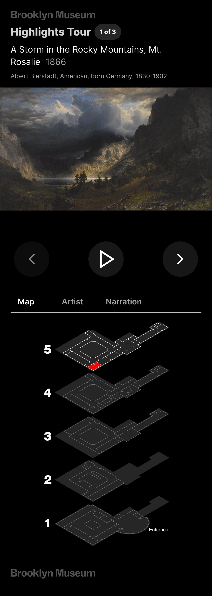

# museum-audio-tour

Powerful tools like [Next.js](https://nextjs.org/), [React](https://react.dev/), [Howler.js](https://howlerjs.com/), and [Konva](https://konvajs.org/) make it possible for museums to easily build performant, responsive and accessible audio guides for their collections.

## Demo

This project has been deployed on Vercel at [https://museum-audio-tour.vercel.app/](https://museum-audio-tour.vercel.app/)

## Dataset

All data was collected via the [Brooklyn Museum Open API](https://www.brooklynmuseum.org/opencollection/api/docs) and [Brooklyn Museum Audio Guides](https://www.brooklynmuseum.org/visit/bloomberg_connects)

## Next.js template

Based on https://github.com/shadcn/next-template ([Website](https://template.shadcn.com/), [UI Components](https://ui.shadcn.com/)),
which is an implementation of [Radix UI](https://www.radix-ui.com/) with [Tailwind](https://tailwindcss.com/) and other helpful utilities.

## Features

- Audio narration
- Synced annotations
- Synced pan and zoom of images
- Audio handling with [Howler.js](https://howlerjs.com/)
- Image pan & zoom with [Konva](https://konvajs.org/)
- Meta & OG meta tags
- [lucide-react icons](https://github.com/lucide-icons/lucide)
- [Tailwind CSS](https://tailwindcss.com/)
- [next-themes](https://github.com/pacocoursey/next-themes) dark/light modes
- [@next/font](https://nextjs.org/docs/api-reference/next/font) font loading

## Adopt it yourself

This is just a prototype, ideally the `/public/tours/tours.json` file comes from a backend CMS.

## Installation & Running

### Download & Install

Fork/download this project and run `npm i` to install dependencies.

Then, run the development server with `npm run dev` and open http://localhost:3000 with your browser to see the result.

If you have not yet loaded the Elasticsearch data, you should see an error on the search page that the index does not exist.

## License

Licensed under the [MIT license](https://github.com/shadcn/ui/blob/main/LICENSE.md).

## Screenshots

### Notes

Annotation regex:

\[(.+)\]\n(.+)\n\[(.+)\]\n
{\n"start": $1,\n"end": $3,\n"text": "$2"\n},